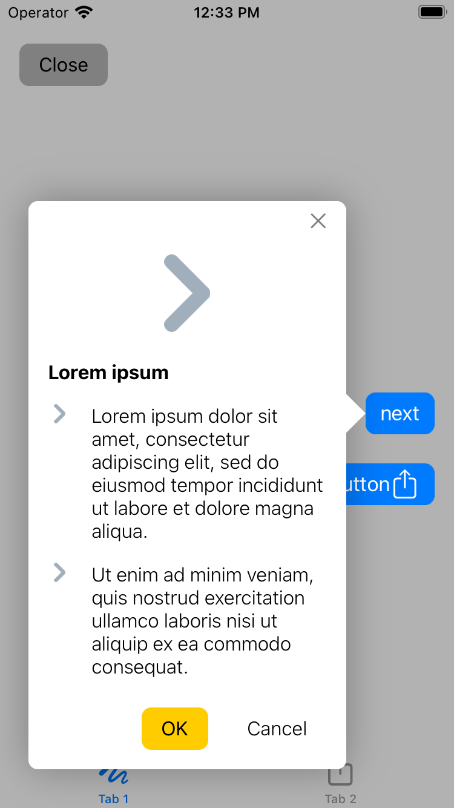
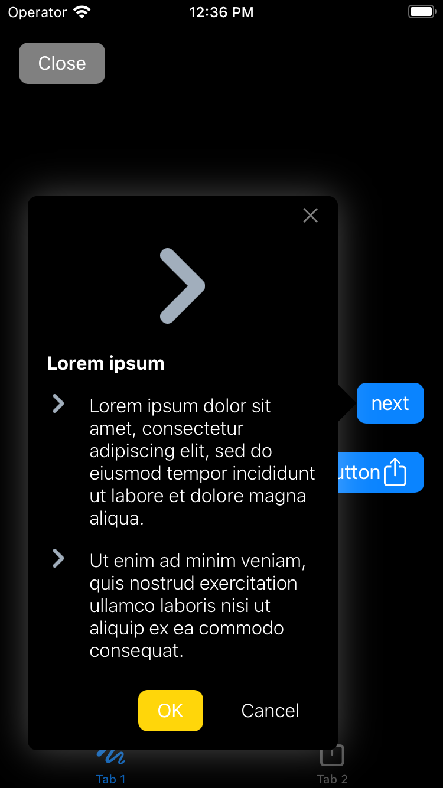

# Inflective Tooltip View
   

Package for custom tooltips in your application




## Installing
Inflective Tooltip View support [Swift Package Manager](https://www.swift.org/package-manager/).

### Swift Package Manager
``` swift
// swift-tools-version:5.1

import PackageDescription

let package = Package(
  name: "YourTestProject",
  platforms: [
       .iOS(.v12),
  ],
  dependencies: [
    .package(name: "InflectiveTooltipView", url: "https://github.com/mark-kebo/InflectiveTooltipView", from: "1.0.0")
  ],
  targets: [
    .target(name: "YourTestProject", dependencies: ["InflectiveTooltipView"])
  ]
)
```
And then import wherever needed: ```import InflectiveTooltipView```

#### Adding it to an existent iOS Project via Swift Package Manager

1. Using Xcode 11 go to File > Swift Packages > Add Package Dependency
2. Paste the project URL: https://github.com/mark-kebo/InflectiveTooltipView
3. Click on next and select the project target
4. Don't forget to set `DEAD_CODE_STRIPPING = NO` in your `Build Settings` (https://bugs.swift.org/plugins/servlet/mobile#issue/SR-11564)

If you have doubts, please, check the following links:

[How to use](https://developer.apple.com/videos/play/wwdc2019/408/)

[Creating Swift Packages](https://developer.apple.com/videos/play/wwdc2019/410/)

After successfully retrieved the package and added it to your project, just import `InflectiveTooltipView` and you can get the full benefits of it.

## Usage example

Setup configuration and show tooltip controller:

``` swift
import InflectiveTooltipView

let tooltipItems: [InflectiveTooltipItemProtocol] = [
                    InflectiveTooltipImageItem(image: UIImage(named: "test-image"), imageSize: CGSize(width: 64, height: 64)),
                    InflectiveTooltipTextItem(text: attributtedTitle(text: "Test", weight: .light), image: UIImage(named: "test-image")),
                    InflectiveTooltipActionsItem(firstAction: InflectiveTooltipActionItem(title: attributtedTitle(text: "cancel", weight: .regular),
                                                                                          backgroundColor: .systemYellow,
                                                                                          completion: { [weak self] in
                                                                                              //Some action
                                                                                          }),
                                                 secondAction: nil,
                                                 alignment: .trailing)
]
var config = InflectiveTooltipConfiguration()
config.arrowHeight = 16
config.isNeedShadow = true
config.isTooltipClosable = true
config.topAction = InflectiveTooltipActionItem(title: attributtedTitle(text: "Close", weight: .regular),
                                               backgroundColor: .gray) { [weak self] in
    //Some top action
}
config.highlightedViews = [button1, button]
let controller = InflectiveTooltipViewController(params: InflectiveTooltipParams(tooltipItems: tooltipItems,
                                                                                 pointingView: button,
                                                                                 configuration: config))
controller.present(in: navigationController)

```
### Important

You need to set `pointingView` in `InflectiveTooltipParams`. This is exactly the view to which the tooltip will be attached.
Also if you need highlight some views, you can use `highlightedViews` in `InflectiveTooltipConfiguration`.
